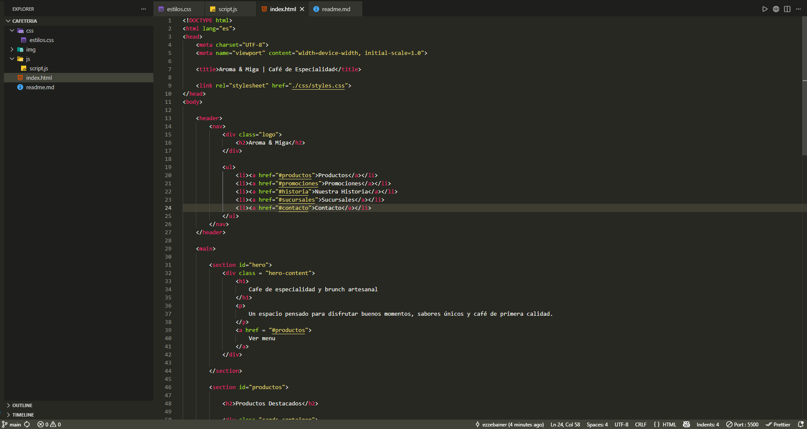

# Aroma & Miga ☕

Proyecto de portfolio desarrollado para simular una cafetería moderna de especialidad.

## 📌 Objetivo

Diseñar y desarrollar una landing page profesional para una cafetería ficticia, aplicando buenas prácticas de desarrollo web y enfocándose en resolver necesidades reales de negocios gastronómicos.

Este proyecto forma parte de mi portfolio como desarrollador y busca replicar funcionalidades y diseños que suelen utilizar cafeterías modernas para mejorar su presencia digital.

---

## 🚀 Características previstas

- Landing page responsive.
- Hero con video institucional.
- Productos destacados.
- Promociones y novedades.
- Historia de la marca.
- Información de sucursales.
- Formulario de contacto.
- Integración con WhatsApp.
- Diseño moderno y optimizado para dispositivos móviles.

---

## 🛠 Tecnologías utilizadas

- HTML5
- CSS3
- JavaScript
- Git
- GitHub

---

## 📅 Roadmap

### Versión 1 - Landing Page

- [x] Estructura inicial del proyecto
- [x] Navbar
- [x] Hero Section
- [ ] Productos Destacados
- [ ] Promociones
- [ ] Historia
- [ ] Sucursales
- [ ] Contacto
- [ ] Footer
- [ ] Responsive Design

### Versión 2 - Funcionalidades

- [ ] Menú completo interactivo
- [ ] Sistema de reservas
- [ ] Integración avanzada con WhatsApp
- [ ] Formulario funcional

### Versión 3 - Automatizaciones

- [ ] Captación de leads
- [ ] Newsletter
- [ ] Automatizaciones de contacto
- [ ] Programa de fidelización

---

## 📂 Estructura del proyecto

```text
/
├── index.html
├── css/
│   └── styles.css
├── js/
│   └── script.js
├── img/
└── README.md
```

---

## 🎯 Objetivos de aprendizaje

- Mejorar habilidades de maquetación web.
- Aplicar diseño responsive.
- Practicar organización de proyectos reales.
- Construir piezas de portfolio reutilizables para futuros clientes.
- Simular el desarrollo de una solución digital para un negocio real.

---

## 📸 Evolución del proyecto




---

## 👨‍💻 Autor

**Eze Bainer**

Proyecto realizado con fines educativos, de práctica profesional y construcción de portfolio.