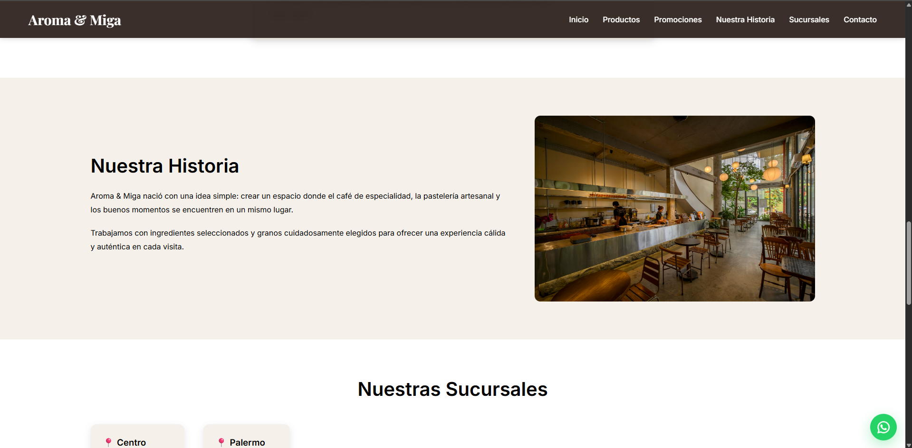
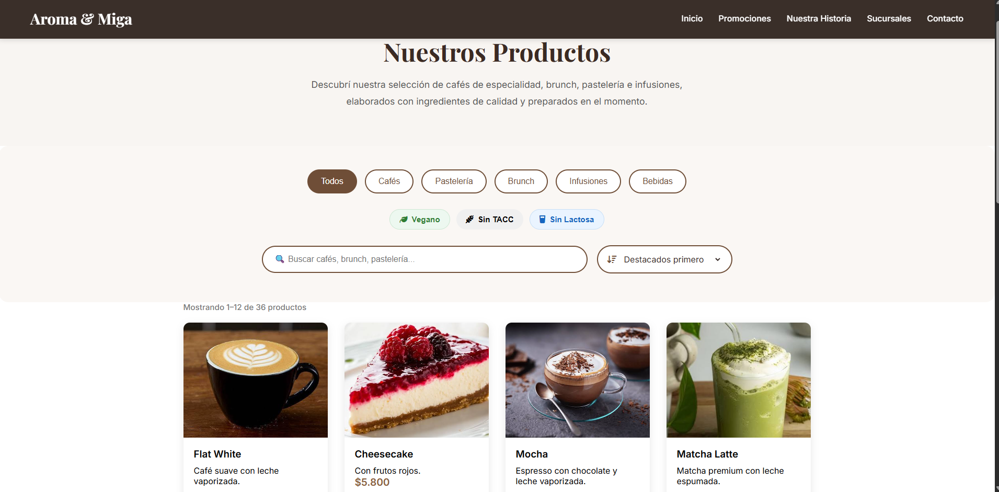

# ☕ Aroma & Miga

Sitio web responsive para una cafetería ficticia de especialidad, desarrollado como proyecto de práctica para fortalecer conocimientos de HTML, CSS y JavaScript.

El proyecto simula la presencia online de una cafetería moderna, con un catálogo interactivo de productos, promociones y secciones informativas.

---

## 🚀 Demo

👉 https://nebainer.github.io/aroma-y-miga-website/

---

## 📸 Capturas




---

## ✨ Funcionalidades

- Landing page moderna y responsive.
- Hero con video de fondo.
- Catálogo dinámico de productos.
- Modal con información detallada.
- Filtrado por categorías.
- Filtrado por etiquetas.
- Buscador con debounce.
- Ordenamiento de productos.
- Combinación de filtros.
- Paginación.
- Estado vacío cuando no existen resultados.
- Botón flotante de WhatsApp.
- Animaciones y transiciones.
- Navegación responsive con menú hamburguesa.

---

## 🛠 Tecnologías

- HTML5
- CSS3
- JavaScript (ES6)
- Font Awesome
- Google Fonts

---

## 📁 Estructura del proyecto

```text
📦 Aroma & Miga
│
├── css/
│   ├── estilos.css
│   ├── index.css
│   └── productos.css
│
├── js/
│   ├── productos.js
│   ├── badges.js
│   ├── ui.js
│   └── script.js
│
├── img/
├── video/
│
├── index.html
└── productos.html
```

---

## 🎯 Objetivos del proyecto

Este proyecto fue desarrollado para practicar conceptos fundamentales del desarrollo frontend:

- Manipulación del DOM.
- Programación orientada a objetos.
- Componentes reutilizables.
- Manejo de estado.
- Responsive Design.
- Organización de archivos.
- Buenas prácticas de JavaScript.

---

## 👨‍💻 Autor

**Ezequiel Bainer**

- GitHub: https://github.com/NEBainer
- LinkedIn: [LINKEDIN](https://www.linkedin.com/in/ezequielbainer/)